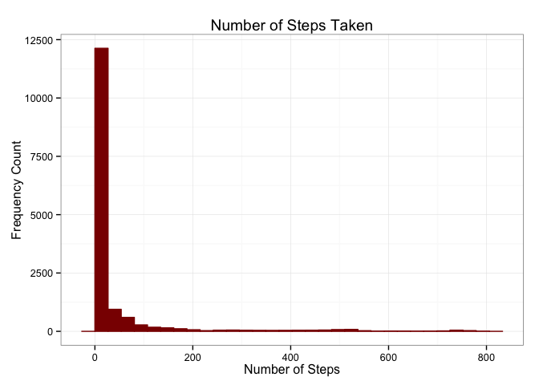
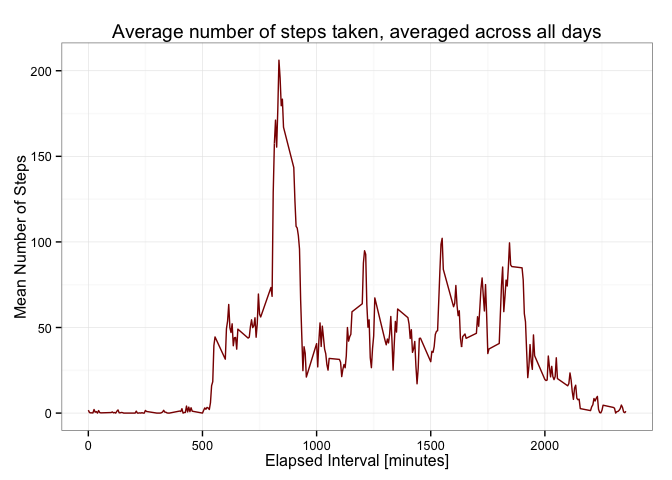
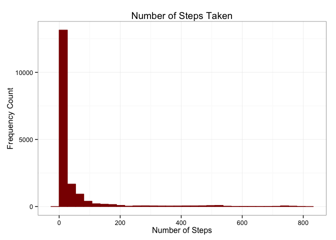
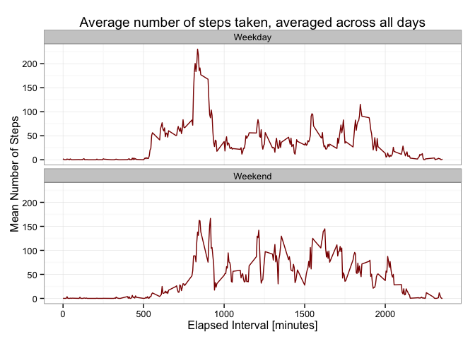

# Reproducible Research: Peer Assessment 1
Mark Evans  
## Load up required libraries
Enironment is R version 3.1.1 with GGPlot for graphics. Load up the required libraries.


```r
library(ggplot2)
```


## Loading and preprocessing the data
>Show any code that is needed to
>
>1. Load the data (i.e. `read.csv()`)
>
>2. Process/transform the data (if necessary) into a format suitable for your analysis

Load up the activity data set and then remove any na readings as these are to be ignored. The cleaned data set will be used for analysis.


```r
activity.raw <- read.csv("activity.csv")
activity.clean <- na.omit(activity.raw)
```


## What is mean total number of steps taken per day?
>For this part of the assignment, you can ignore the missing values in the dataset.
>
>1. Make a histogram of the total number of steps taken each day
>
>2. Calculate and report the **mean** and **median** total number of steps taken per day

Generate a histogram of the number of steps taken and then determine the mean and median of the number of steps taken. In all cases na values are ignored.


```r
plot <- ggplot(activity.clean, aes(x=steps))
plot +
        geom_histogram(fill = "darkred", colour = "darkred") +
        xlab("Number of Steps") +
        ylab("Frequency Count") +
        ggtitle("Number of Steps Taken") +
        theme_bw()
```

```
## stat_bin: binwidth defaulted to range/30. Use 'binwidth = x' to adjust this.
```

 

```r
activity.mean <- mean(activity.clean$steps)
activity.median <- median(activity.clean$steps)
```
Mean number of steps is: **37.3826**

Median number of steps is: **0**


## What is the average daily activity pattern?
>1. Make a time series plot (i.e. `type = "l"`) of the 5-minute interval (x-axis) and the average number of steps taken, averaged across all days (y-axis)
>
>2. Which 5-minute interval, on average across all the days in the dataset, contains the maximum number of steps?

Generate the average number of steps for each of the 5 minute periods and store this in a data frame so that GGPlot can process and generate the interval/average steps plot.

Then determine which row of the dataframe has the maximum number of steps and output the corresponding interval for this.


```r
meansteps <- tapply(activity.clean$steps, activity.clean$interval, mean, simplify=TRUE)

plot.data <- data.frame(interval=as.numeric(row.names(meansteps)), meansteps=as.numeric(meansteps))

plot <- ggplot(plot.data, aes(x=interval, y=meansteps))
plot +
        geom_line(aes(group=1), colour = "darkred") +
        xlab("Elapsed Interval [minutes]") +
        ylab("Mean Number of Steps") +
        ggtitle("Average number of steps taken, averaged across all days") +
        theme_bw()
```

 

```r
maxmeansteps <- which.max(plot.data$meansteps)
```

Which 5-minute interval, on average across all the days in the dataset, contains the maximum number of steps? **835**


## Imputing missing values
>Note that there are a number of days/intervals where there are missing
>values (coded as `NA`). The presence of missing days may introduce
>bias into some calculations or summaries of the data.
>
>1. Calculate and report the total number of missing values in the dataset (i.e. the total number of rows with `NA`s)
>
>2. Devise a strategy for filling in all of the missing values in the dataset. The strategy does not need to be sophisticated. For example, you could use the mean/median for that day, or the mean for that 5-minute interval, etc.
>
>3. Create a new dataset that is equal to the original dataset but with the missing data filled in.
>
>4. Make a histogram of the total number of steps taken each day and Calculate and report the **mean** and **median** total number of steps taken per day. Do these values differ from the estimates from the first part of the assignment? What is the impact of imputing missing data on the estimates of the total daily number of steps?


### #1 Missing values
The number of missing values is the length difference between the raw and clean dataframes.


```r
NAcount <- length(activity.raw[,1]) - length(activity.clean[,1])
```

The number of NA rows is: **2304**


### #2 & #3 Populate missing values with a suitable value
Selected strategy is to replace any step data that has NA with the average for that time interval.


```r
na.mark <- is.na(activity.raw$steps)
activity.manipulated <- activity.raw
activity.manipulated$steps[na.mark] <- meansteps
```


### #4 Reprocess this new dataset
Re-generate the histogram of the number of steps taken and then determine the mean and median of the number of steps taken. 


```r
plot <- ggplot(activity.manipulated, aes(x=steps))
plot +
        geom_histogram(fill = "darkred", colour = "darkred") +
        xlab("Number of Steps") +
        ylab("Frequency Count") +
        ggtitle("Number of Steps Taken") +
        theme_bw()
```

```
## stat_bin: binwidth defaulted to range/30. Use 'binwidth = x' to adjust this.
```

 

```r
activity.mean <- mean(activity.manipulated$steps)
activity.median <- median(activity.manipulated$steps)
```
Mean number of steps is: **37.3826**

Median number of steps is: **0**

**Conclussion**: There is no difference between these values and those obtained by ignoring steps that have NA values. The reason is that the mean for interval was used as the substitution value.


## Are there differences in activity patterns between weekdays and weekends?
>For this part the `weekdays()` function may be of some help here. Use
>the dataset with the filled-in missing values for this part.
>
>1. Create a new factor variable in the dataset with two levels -- "weekday" and "weekend" indicating whether a given date is a weekday or weekend day.
>
>2. Make a panel plot containing a time series plot (i.e. `type = "l"`) of the 5-minute interval (x-axis) and the average number of steps taken, averaged across all weekday days or weekend days (y-axis).

First generate a vector containing the days of the week for the dataset (note the manipulated dataset is being used).
Modify this vector to identify weekdays and weekends by first replacing "Saturday" with "Weekend", then the same for "Sunday" and then replace anything that is not "Weekend" with "Weekday".


```r
activity.manipulated.weekdays <- weekdays(as.Date(activity.manipulated$date))
activity.manipulated.weekdays[activity.manipulated.weekdays=="Saturday"] <- "Weekend"
activity.manipulated.weekdays[activity.manipulated.weekdays=="Sunday"] <- "Weekend"
activity.manipulated.weekdays[activity.manipulated.weekdays!="Weekend"] <- "Weekday"
```

Generate the mean number of steps for each interval as before but with separate means for weekdays and weekend days.

My method is probably not the slickest and I think it could be possible to use a combination of split and sapply to achieve the same result.


```r
meanStepsFactor <- function(data, factors, select) {
        # This function is specific for this analysis.
        # It takes a dataset and, for the selected day type, generates the mean number of steps for each interval 
        temp <- data[factors==select,]
        result <- tapply(temp$steps, temp$interval, mean, simplify=TRUE)
        result <- data.frame(as.numeric(row.names(result)), result, select)
        colnames(result) <- c("Interval", "MeanSteps", "DayType")       
        return(result)
}

meansteps.weekday <- meanStepsFactor(activity.manipulated, activity.manipulated.weekdays, "Weekday")
meansteps.weekend <- meanStepsFactor(activity.manipulated, activity.manipulated.weekdays, "Weekend")

plot.data <- rbind(meansteps.weekday, meansteps.weekend)

plot <- ggplot(plot.data, aes(x=Interval, y=MeanSteps))
plot +
        geom_line(colour="darkred") +
        xlab("Elapsed Interval [minutes]") +
        ylab("Mean Number of Steps") +
        ggtitle("Average number of steps taken, averaged across all days") +
        facet_wrap(~DayType, ncol=1) +
        theme_bw()
```

 


